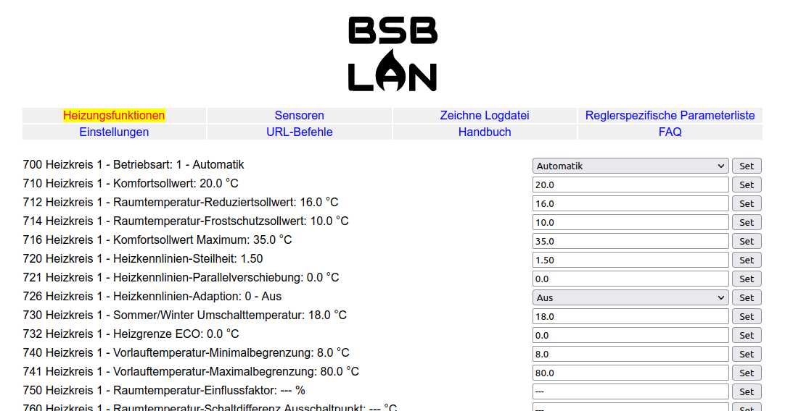
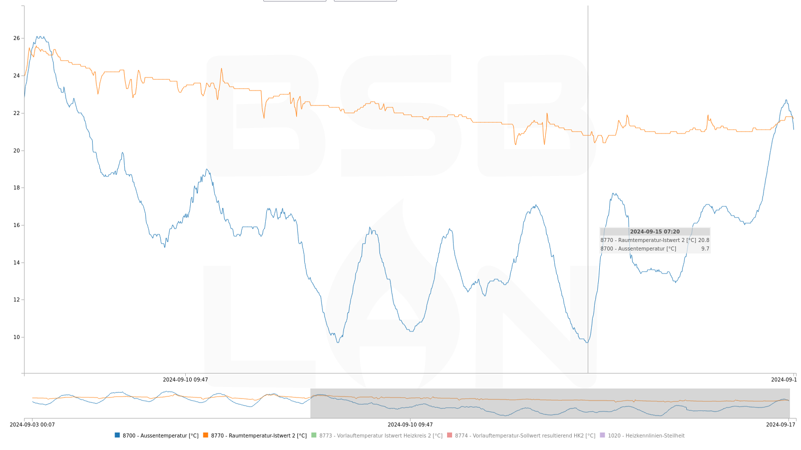

# Verwendung von BSB-LAN

## Steuerung der Heizung über die Web-Oberfläche

Als erster Schritt – oder wenn du deine Heizung einfach nur ein- oder ausschalten willst – kannst du einfach die BSB-LAN Web-Oberfläche öffnen und zum *Einstellungen*-Menü gehen. Dort wird eine Liste von Kategorien deines Heizungsreglers angezeigt.

Du kannst auf jede Kategorie klicken und erhältst eine Liste der entsprechenden Parameter. Wenn du eine `Set`-Schaltfläche siehst, bedeutet das, dass der Parameter geändert werden kann, und wenn du darauf klickst, wird der neue Wert an die Heizung gesendet. Wenn keine `Set`-Schaltfläche vorhanden ist, ist der Parameter schreibgeschützt und kann nicht geändert werden.

---

## Verwendung der URL-Befehle von BSB-LAN

Die meisten Funktionen von BSB-LAN können mithilfe von URL-Befehlen gesteuert werden. Diese sind nützlich oder sogar notwendig, wenn du BSB-LAN mit einem [Hausautomatisierungssystem](homeautomation.md) verbindest, aber sie bieten auch Zugang zu Funktionen, die nicht direkt über die Web-Oberfläche zugänglich sind.

URL-Befehle werden direkt nach dem Hostnamen von BSB-LAN und einem (optionalen) Passwort aufgerufen. Um also eine Liste von Kategorien zu erhalten, müsstest du die URL `http://bsb-lan.local/K` (oder `http://bsb-lan.local/1234/K`, wenn das Passwort `1234` verwendet wird) öffnen.

### Abfragen und Einstellen von Parametern

| URL-Befehl | Funktionalität |
|:----------|:------------|
|`/<x>`     | Abfragen der Einstellung des Parameters `<x>` |
|`/<x>!<addr>` | Abfragen der Einstellung des Parameters `<x>` vom Regler an der Zieladresse `<addr>` |
|`/<x>/<y>/<z>` | Abfragen der Einstellungen der Parameter `<x>`, `<y>` und `<z>`. Parameter können `!` enthalten, um verschiedene Regler anzusprechen. |
|`/<x>-<y>` | Abfragen der Einstellungen der Parameter von `<x>` bis `<y>` |
|`/<x>!<addr>-<y>` | Abfragen der Einstellungen der Parameter von `<x>` bis `<y>` vom Regler an der Zieladresse `<addr>` |
|`/K` | Auflisten aller Parameterkategorien vom Regler an der Standard-Zieladresse |
|`/K!<addr>` | Auflisten aller Parameterkategorien vom Regler an der Zieladresse `<addr>` |
|`/K<x>` | Abfragen aller Parameter der Kategorie `<x>` vom Regler an der Standard-Zieladresse |
|`/K<x>!<addr>` | Abfragen aller Parameter der Kategorie `<x>` vom Regler an der Zieladresse `<addr>` |
|`/S<x>=<y>` | Einstellen des Parameters `<x>` vom Regler an der Standard-Zieladresse auf den Wert `<y>`. Um einen Parameter auf `---` (aus/deaktiviert) zu setzen, sende einfach einen leeren Wert: `S<x>=` |
|`/S<x>!<addy>=<y>` | Einstellen des Parameters `<x>` vom Regler an der Zieladresse `<addr>` auf den Wert `<y>` |
|`/I<x>=<y>` | Senden des Werts `<y>` als INF-Telegramm an den Parameter `<x>`. Bisher nur erforderlich beim Einstellen der Raumtemperatur (Parameter 10000 ff.) |

### Konfiguration

| URL-Befehl | Funktionalität |
|:----------|:------------|
|`/C` | Konfiguration |
|`/CO` | Speichern der BSB-LAN-Konfiguration |
|`/P<x>,<y>,<z>` | Temporäres Einstellen des Bustyps auf `<x>`, der eigenen Adresse auf `<y>` und der Zieladresse auf `<z>` |
|`/V<x>` | Aktivieren (`1`) oder Deaktivieren (`0`) des ausführlichen Ausgabemodus. Sollte aktiviert bleiben, es sei denn, es wird explizit anders angegeben. |

### Protokollierung

| URL-Befehl | Funktionalität |
|:----------|:------------|
|`/DG` | Grafische Darstellung (Diagramm) einer aktiven Protokolldatei |
|`/D` oder `/DD` | Auslesen der Protokolldatei `datalog.txt` vom Speicher. Enthält die protokollierten Parameter und Werte, wenn die Protokollierung auf SD-Karte aktiviert ist. |
|`/D<n>` | Auslesen der letzten `<n>` Kalendertage der Protokolldatei |
|`/D<a>,<b>` | Auslesen der Daten aus der Protokolldatei zwischen `<a>` und `<b>`. `<a>` und `<b>` müssen im Format JJJJ-MM-TT angegeben werden (z.B. `/D2024-04-01,2024-04-30`) |
|`/D0` | Zurücksetzen beider Protokolldateien `datalog.txt` und `journal.txt` und Erstellen neuer Header. Sollte vor der ersten Protokollierung ausgeführt werden. |
|`/DK<n>` | Löschen von Daten, die älter sind als `<n>` Tage, aus der Protokolldatei |
|`/LN` | Erzwingen der Protokollierung unabhängig vom aktuellen Intervall und Neustarten des konfigurierten Intervalls zu diesem Zeitpunkt |
|`/L=<x>,<y>,<z>` | Einstellen des Protokollierungsintervalls auf `<x>` Sekunden und (optional) Zurücksetzen der Protokollierungsparameter auf `<y>`, `<z>` usw. bis zum Neustart |
|`/L=0,0` | Deaktivieren der Protokollierung auf dem Speicher bis zum Neustart |
|`/LB=<x>` | Nur Broadcast-Telegramme (`1`) oder alle Telegramme (`0`) protokollieren. Einstellung gilt bis zum Neustart. |
|`/LU=<x>` | Nur unbekannte Bus-Telegramme (`1`) oder alle Telegramme (`0`) protokollieren. Einstellung gilt bis zum Neustart. |
|`/A=0` | Deaktivieren der 24-Stunden-Durchschnittsberechnung bis zum Neustart |
|`/A=<x>,<y>,<z>` | Ändern der 24-Stunden-Durchschnittswertberechnung auf die Parameter `<x>`, `<y>` und `<z>` bis zum Neustart |
|`/B0` | Zurücksetzen der Statistiken für kumulierte Brennerlaufzeiten und -zyklen |
|`/DD0` | Entfernen der Protokolldatei `datalog.txt` |
|`/DJ` | Auslesen der Protokolldatei `journal.txt` vom Speicher |
|`/DJ0` | Entfernen der Protokolldatei `journal.txt` |
|`/LD` | Deaktivieren der Protokollierung von Telegrammen in `journal.txt` bis zum Neustart |
|`/LE` | Aktivieren der Protokollierung von Telegrammen in `journal.txt` |

### Parameterinformationen

| URL-Befehl | Funktionalität |
|:----------|:------------|
|`/E<x>` | Anzeigen der Parameteroptionen des Parameters `<x>`. Nur verfügbar für Parameter vom Typ Option, wie Datentypen `VT_ENUM`, `VT_CUSTOM_ENUM`, `VT_BITS` und `VT_CUSTOM_BITS`. |
|`/R<x>` | Abfragen der Standard-Einstellung des Parameters `<x>` |

### GPIO-Steuerung

| URL-Befehl | Funktionalität |
|:----------|:------------|
|`/G<x>` | Anzeigen des tatsächlichen Zustands des GPIO-Pins `<x>` |
|`/G<x>=<y>` | Setzen des GPIO-Pins `<x>` auf HIGH (`<y>` = `1`) oder LOW (`<y>` = `0`) |

### JSON-Schnittstelle

**Für eine komplette Struktur der JSON API siehe [hier in der OpenAPI Dokumentation](https://editor.swagger.io/?url=https://raw.githubusercontent.com/fredlcore/bsb_lan/master/openapi.yaml).**

| URL-Befehl | Funktionalität |
|:----------|:------------|
|`/JQ=<x>,<y>,<z>`|Abfragen der Parameter `<x>`, `<y>` und `<z>` und Zurückgeben einer JSON-Struktur|
|`/JQ`      |Abfragen von Parametern basierend auf einer empfangenen JSON-Struktur über HTTP POST|
|`/JS`      |Einstellen von Parametern basierend auf einer empfangenen JSON-Struktur über HTTP POST|
|`/JR<x>`   |Abfragen des Standardwerts des Parameters `<x>` und Zurückgeben einer JSON-Struktur|
|`/JK=ALL`  |Ausgeben der Parameter-Bereiche für alle verfügbaren Kategorien als JSON-Struktur|
|`/JK=<x>`  |Ausgeben der Parameterstruktur aller Parameter der Kategorie `<x>`|
|`/JC=<x>,<y>,<z>`|Ausgeben der Parameterstruktur `<x>`, `<y>` und `<z>`. Gleiche JSON-Struktur wie `/JK=<x>`.|
|`/JC       |Ausgeben der Parameterstruktur von einer über HTTP POST empfangenen Parameterliste. Gleiche JSON-Struktur wie `/JK=<x>`.|
|`/JB`      |Erstellen einer Sicherung aller beschreibbaren Parameter in einer JSON-Struktur, die zum Zurückschreiben mit `/JS` verwendet werden kann|
|`/JL`      |Erstellen einer JSON-Struktur der BSB-LAN-Konfigurationseinstellungen|
|`/JW`      |Schreiben der Konfigurationseinstellungen basierend auf einer JSON-Struktur, die mit `/JL` erstellt wurde.|
|`/JI`      |Ausgeben von Laufzeitinformationen von BSB-LAN als JSON-Struktur|
|`/JV`      |Zurückgeben der Version der BSB-LAN-JSON-API als JSON-Struktur|

### Verschiedenes

| URL-Befehl | Funktionalität |
|:----------|:------------|
|`/M<x>!<y>` | Senden (`<x>=1`) oder Widerrufen (`<x>=0`) von MQTT Auto-Discovery-Nachrichten für alle Parameter vom Regler an der Zieladresse `<y>` |
|`/N` | Zurücksetzen und Neustarten des Mikrocontrollers (dauert ca. 15 Sekunden) |
|`/NE` | Löschen des EEPROM und Neustarten des Mikrocontrollers. Alle Konfigurationseinstellungen werden anschließend aus der Konfigurationsdatei gelesen, bis sie in der Web-Oberfläche gesetzt und erneut gespeichert werden, um sie in das EEPROM zu schreiben. |
|`/QD` | Ausgeben der Parameterstruktur des Heizungssystems |
|`/W` | Mit einem vorangestellten `/W` geben die URL-Befehle `C`, `S` und `Q` Daten ohne HTML-Header und -Footer zurück (z.B.: `/WC` oder `/WS<x>=<y!z>`). |

---

## Verwendung der grafischen Diagrammfunktion

Wenn protokollierte Daten auf dem Speicher (entweder SD-Karte oder internem Flash-Speicher) verfügbar sind, wird **Protokolldatei anzeigen** anklickbar. Standardmäßig werden die protokollierten Daten im Browser angezeigt.

Um auf die protokollierten Daten selbst (in der Datei `datalog.txt`) zuzugreifen, verwende den oben genannten URL-Befehl `/D`.

Standardmäßig zeigt "Protokolldatei anzeigen" die Protokolldaten der letzten `n` Kalendertage an (`n=DEFAULT_DAYS_TO_PLOT`, konfigurierbar in `BSB_LAN_config.h`). Anschließend können Steuerelemente auf der Webseite verwendet werden, um einen anderen Bereich auszuwählen, abhängig von den in der Protokolldatei enthaltenen Daten.

Mauszeiger, Klick und Mausradaktionen innerhalb der grafischen Anzeige bieten verschiedene Steueroptionen:

- Bessere Lesbarkeit von Zahlenwerten bei eng beieinander liegenden Plot-Linien (Mouseover auf Plot)
- Benutzer können Plot-Linien interaktiv hervorheben, um die Übersichtlichkeit zu verbessern (Mouseover auf Legende)
- Benutzer können Plot-Linien interaktiv deaktivieren, um die Übersichtlichkeit und die vertikale Skalierung zu verbessern (Klick auf Legende)
- Zoomen (Mausrad/Pinch auf Plot) und Verschieben (ziehen des gezoomten Plots)

Für eine weitere Verarbeitung kannst du dieses [Python-Skript](https://github.com/DE-cr/BSB-LAN/tree/BSB-LAN_evaluate_datalogs/BSB_LAN/scripts/BSB-LAN_evaluate_datalogs) verwenden, das die Protokollausgabe von BSB-LAN in Pivot-CSV-Dateien umwandelt, die für aussagekräftigere Diagramme verwendet werden können.
