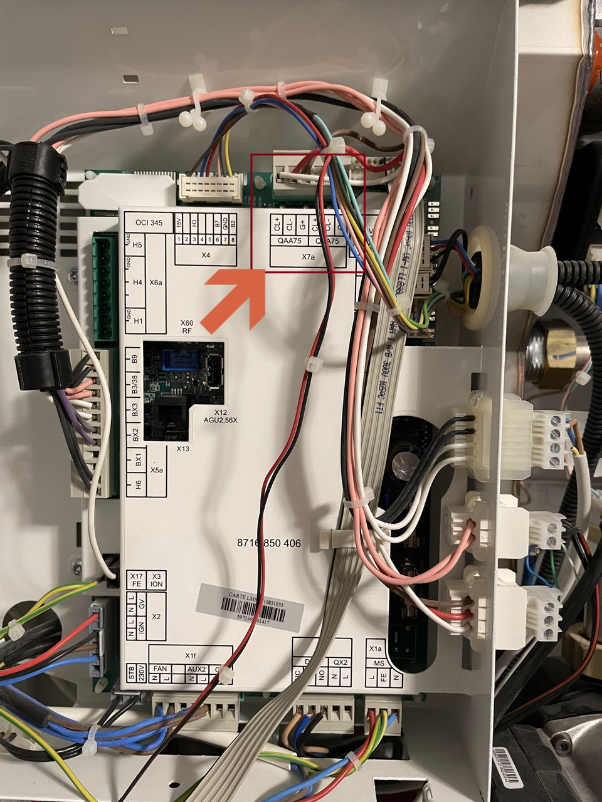
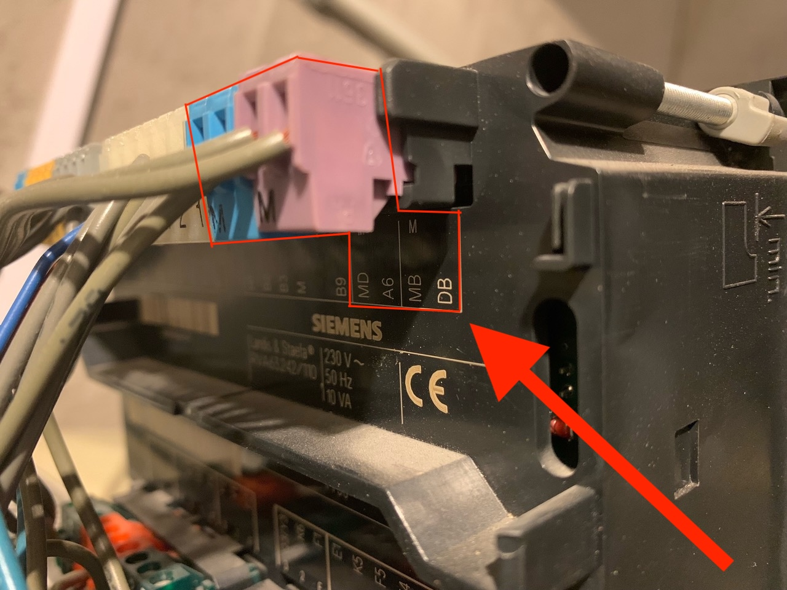
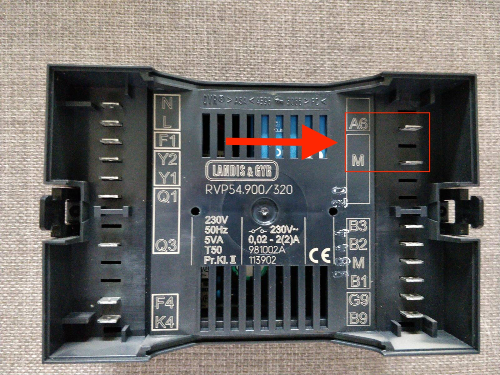
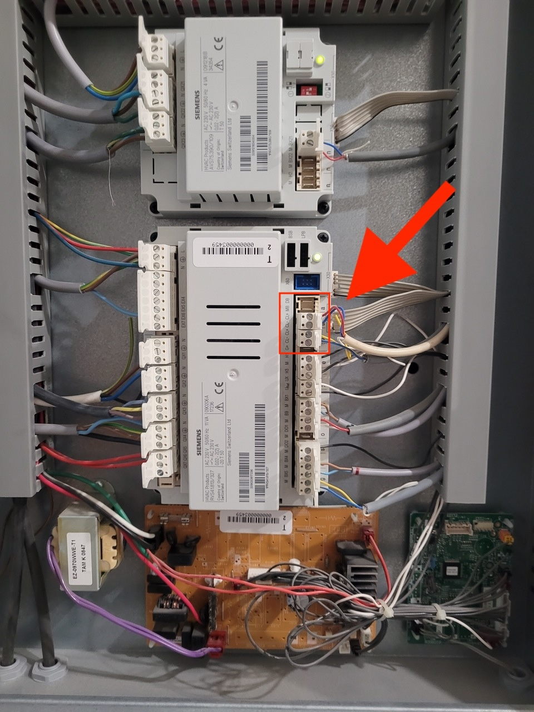
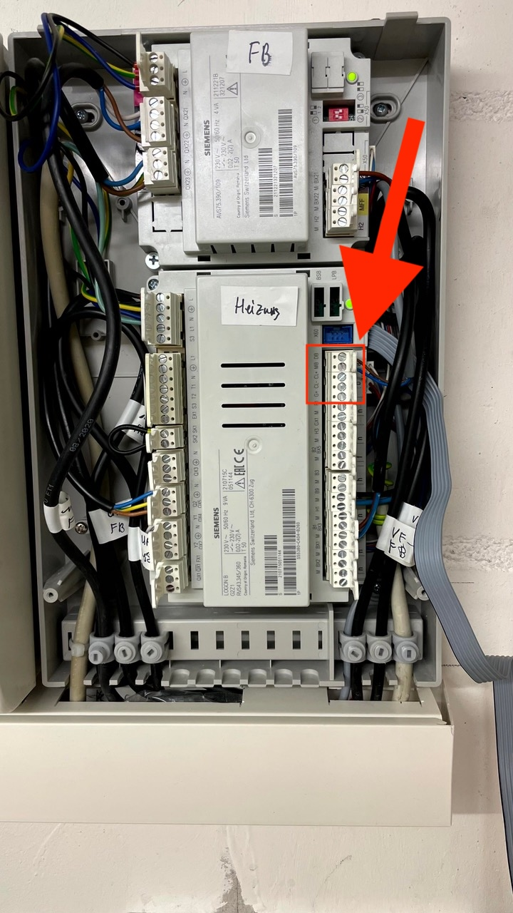
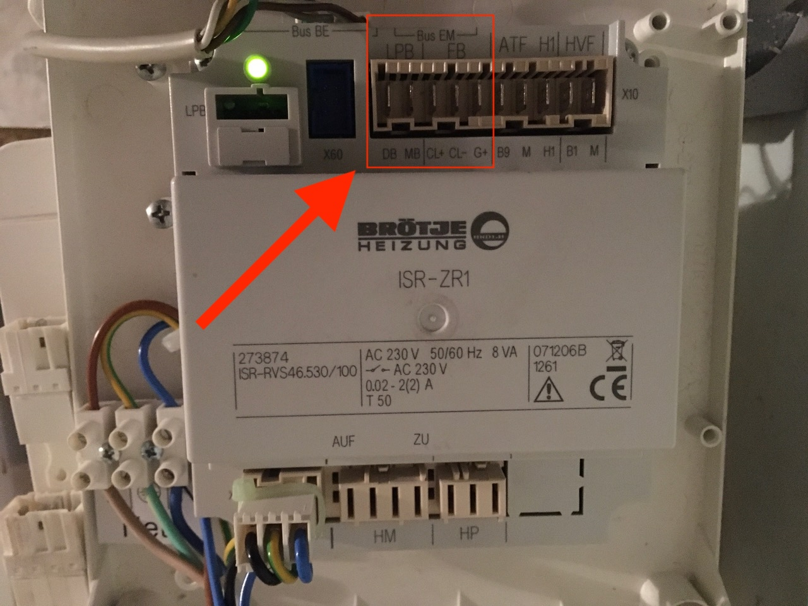
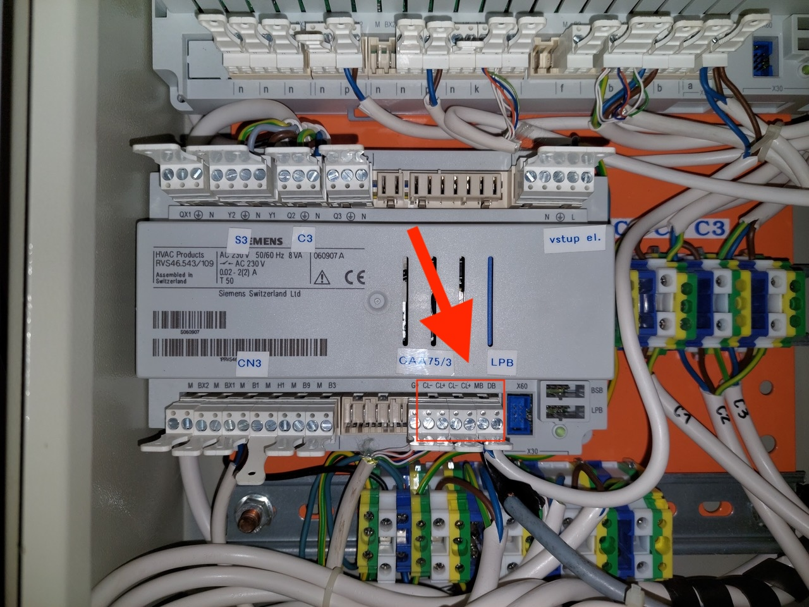
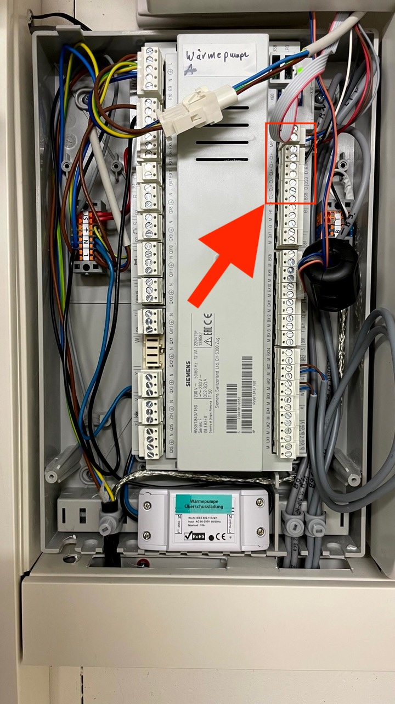
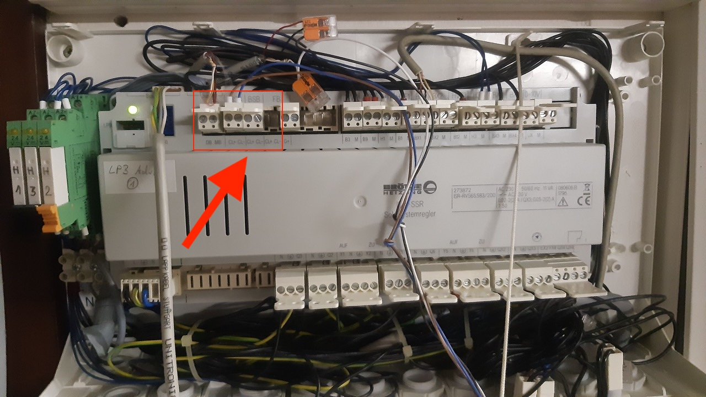

# Systèmes de chauffage pris en charge

BSB-LAN prend en charge les systèmes de chauffage qui communiquent à l'aide du [BSB (Boiler System Bus)](bus_systems.md#BSB), du [LPB (Local Process Bus)](bus_systems.md#LPB) ou du [PPS (Punkt-zu-Punkt-Schnittstelle)](bus_systems.md#PPS). Ces contrôleurs sont généralement fabriqués par Siemens, les modèles plus anciens peuvent encore porter le nom de "Landis & Stafea" ou "Landis & Gyr".

Nous avons compilé une [liste de modèles fonctionnels](supported_models.md) de différents fabricants de systèmes de chauffage qui ont été confirmés comme fonctionnant avec BSB-LAN, bien qu'il n'y ait pas de garantie à 100 % que les fabricants conservent le nom du modèle mais changent le contrôleur pour un système différent. Assurez-vous donc toujours de vérifier que les bonnes connecteurs sont disponibles.

Voici quelques exemples de contrôleurs de chauffage et des connecteurs utilisés pour se connecter à BSB-LAN. Certains connecteurs ont trois broches, d'autres en ont deux. S'il y a trois broches, **assurez-vous de choisir les deux bonnes (CL+ et CL-)** car la troisième broche (G+) sert à fournir l'éclairage de fond pour l'unité de la pièce. Il n'endommagera pas BSB-LAN, mais il peut être trompeur car la LED de BSB-LAN s'allumera même si elle n'est pas connectée à la bonne broche.

D'ailleurs : Si vous n'avez qu'un seul connecteur et qu'il est déjà occupé par une unité de pièce, il n'y a aucun problème à ajouter BSB-LAN au même connecteur. Faites simplement attention lorsque vous ajoutez les fils pour BSB-LAN.

| Contrôleur | Image | Remarques |
|:--------:|:---:|:------|
| [](){#LMS14}**LMS14**<br>**LMS15** |  | Connexion BSB :<br>**+** = Gauche<br>**-** = Centre |
| **LMS14**<br>**LMS15** |  | Connexion BSB : CL+/CL- |
| **LMS14**<br>**LMS15**<br>Baxi Luna Platinum,<br>Chappee Klista |  | Connexion BSB :<br>Bornier M2<br>Broche 2 : CL-<br>Broche 3 : CL+<br>Consultez les instructions détaillées ici pour <a href="https://github.com/fredlcore/BSB-LAN/wiki/Special-instructions-for-special-heating-systems#js-repo-pjax-container">Baxi Luna Platinum</a>. |
| [](){#LMU64}**LMU54**<br>**LMU64** |  | Connexion LPB :<br>via le plugin OCI420 supplémentaire, voir [détails ci-dessous][OCI420]. |
| [](){#LMU74}**LMU74**<br>**LMU75** |  | Connexion BSB :<br>**+** = Haut<br>**-** = Centre<br>Connexion LPB :<br>via le plugin OCI420 supplémentaire |
| [](){#RVA53}**RVA53** |  | Connexion PPS : A6/MD |
| [](){#RVA63}**RVA63** |  | Connexion LPB : MB/DB<br>Connexion PPS : A6/MD |
| [](){#RVP54}**RVP54** |  | Connexion PPS : A6/M |
| [](){#RVS13}**RVS13** |  | Connexion BSB : CL+/CL- |
| [](){#RVS21}**RVS21** |  | Connexion BSB via le connecteur X86<br>**+** = broche la plus à droite<BR>**-** = deuxième broche à partir de la droite |
| [](){#RVS21-AVS55}**RVS21 avec AVS55** |  | Module d'extension AVS55, placé sur le dessus du RVS21.<br>Connexion BSB via le connecteur X86 :<br>**+** = broche la plus à droite<BR>**-** = deuxième broche à partir de la droite<br>ou via le connecteur X150 :<br>**+** = broche supérieure<BR>**-** = deuxième broche du haut |
| [](){#RVS23}**RVS23** |  | Connexion LPB : LPB/M |
| [](){#RVS41}**RVS41** |  | Connexion BSB : CL+/CL-<br>Connexion LPB : MB/DB |
| [](){#RVS43}**RVS43<br>LOGON B** |  | Connexion BSB : CL+/CL-<br>Connexion LPB : MB/DB |
| [](){#RVS43-ZR1}**RVS46<br>ISR-ZR1** |  | Connexion BSB : CL+/CL-<br>Connexion LPB : MB/DB |
| [](){#RVS46}**RVS46** |  | Connexion BSB : CL+/CL-<br>Connexion LPB : MB/DB |
| [](){#RVS51}**RVS51** |  | Connexion BSB : CL+/CL- |
| [](){#RVS53}**RVS53** |  | Connexion BSB : CL+/CL- |
| [](){#RVS61}**RVS61** |  | Connexion BSB : CL+/CL-<br>Connexion LPB : MB/DB |
| [](){#RVS63}**RVS63** |  | Connexion BSB : CL+/CL-<br>Connexion LPB : MB/DB |
| [](){#RVS65}**RVS65** |  | Connexion BSB : CL+/CL-<br>Connexion LPB : MB/DB |

[](){#OCI420}
## Paramètres de configuration pour OCI420 ##

Faire fonctionner correctement l'OCI420 peut s'avérer un peu difficile s'il ne fait pas déjà partie d'un réseau LPB existant. Si vous connectez l'OCI420 pour la première fois à votre appareil de chauffage et que vous n'avez aucun autre appareil de chauffage LPB, vous obtiendrez très probablement l'"erreur 81" qui indique qu'il y a une erreur de bus. Mais ne vous inquiétez pas, il s'agit très probablement de configurer quelques paramètres pour le faire fonctionner. Pour le LMU64, le paramètre correspondant est 604 (_LPBKonfig0_). Il doit être défini comme suit pour utiliser BSB-LAN comme seul appareil connecté à l'OCI420 :
```
604.0 = 0
604.1 = 1
604.2 = 1
604.3 = 1
604.4 = 1
604.5 = 0
604.6 = 0
604.7 = 0
```

Ensuite, vous devez définir l'adresse LPB de l'OCI420 dans les paramètres 605 (doit être défini sur 1) et 606 (doit être défini sur 0). Par la suite, il ne devrait plus y avoir de message d'erreur et la LED rouge de l'OCI420 devrait clignoter à intervalles réguliers, et vous êtes prêt à connecter et à utiliser BSB-LAN.
**Attention :** Si l'OCI420 est déjà connecté à un autre appareil LPB, **n'apportez aucune modification ici** et connectez plutôt BSB-LAN à l'autre appareil LPB. Il devrait fonctionner sans aucun réglage.

## Liste des modèles de contrôleurs fonctionnels

Il existe de nombreux autres contrôleurs qui sont susceptibles de fonctionner avec BSB-LAN. Faites attention à ces modèles de contrôleurs Siemens dans votre système de chauffage :

--8<-- "docs/en/list_of_controllers.md"
